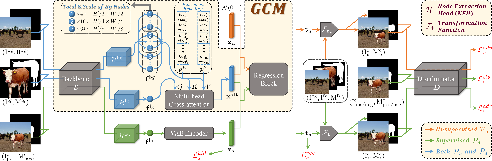

**GracoNet**: Learning Object Placement via Dual-path Graph Completion
========

Official PyTorch Implementation for **GracoNet** (**GRA**ph **CO**mpletion **NET**work).

> **Learning Object Placement via Dual-path Graph Completion** [[arXiv]](https://arxiv.org/abs/2207.11464)
>
> Siyuan Zhou, Liu Liu, Li Niu, Liqing Zhang<br>
> Accepted by **ECCV2022**.

**Object placement methods can be divided into generative methods (*e.g.*, [TERSE](https://arxiv.org/abs/1904.05475), [PlaceNet](https://www.ecva.net/papers/eccv_2020/papers_ECCV/papers/123580562.pdf), [GracoNet](https://arxiv.org/abs/2207.11464)) and discriminative methods (*e.g.*, [FOPA](https://github.com/bcmi/FOPA-Fast-Object-Placement-Assessment/tree/main), [TopNet](https://github.com/bcmi/TopNet-Object-Placement)).** Discriminative methods are more effective and flexible. 

GracoNet is a generative method. In this method, we treat object placement as a graph completion problem and propose a novel graph completion module (GCM). The background scene is represented by a graph with multiple nodes at different spatial locations with various receptive fields. The foreground object is encoded as a special node that should be inserted at a reasonable place in this graph. We also design a dual-path framework upon GCM to fully exploit annotated composite images, which successfully generates plausible and diversified object placement. GracoNet achieves 0.847 accuracy on OPA dataset.





# New Updates

- **Sep 29, 2022**

Change to use the latest version of the official [OPA](https://github.com/bcmi/Object-Placement-Assessment-Dataset-OPA) dataset instead of an old version.


# Model Zoo
We provide models for TERSE [[arXiv]](https://arxiv.org/abs/1904.05475), PlaceNet [[arXiv]](https://www.ecva.net/papers/eccv_2020/papers_ECCV/papers/123580562.pdf), and our GracoNet [[arXiv]](https://arxiv.org/abs/2207.11464):

<table>
  <thead>
    <tr style="text-align: right;">
      <th></th>
      <th>method</th>
      <th>acc.</th>
      <th>FID</th>
      <th>LPIPS</th>
      <th>url of model & logs</th>
      <th>file name</th>
      <th>size</th>
    </tr>
  </thead>
  <tbody>
    <tr>
      <th>0</th>
      <td>TERSE</td>
      <td>0.679</td>
      <td>46.94</td>
      <td>0</td>
      <td><a href="https://cloud.bcmi.sjtu.edu.cn/sharing/nTCaw7sEo">bcmi cloud</a>&nbsp;|&nbsp;<a href="https://pan.baidu.com/s/14mA7j34flDnpB9-MA7_4IQ">baidu disk</a>&nbsp;(code: js71)</td>
      <td>terse.zip</td>
      <td>51M</td>
    </tr>
    <tr>
      <th>1</th>
      <td>PlaceNet</td>
      <td>0.683</td>
      <td>36.69</td>
      <td>0.160</td>
      <td><a href="https://cloud.bcmi.sjtu.edu.cn/sharing/sJ68J02yV">bcmi cloud</a>&nbsp;|&nbsp;<a href="https://pan.baidu.com/s/1ARGL_Z6cczEAXfEZZvxIjQ">baidu disk</a>&nbsp;(code: y0gh)</td>
      <td>placenet.zip</td>
      <td>86M</td>
    </tr>
    <tr>
      <th>2</th>
      <td>GracoNet</td>
      <td>0.847</td>
      <td>27.75</td>
      <td>0.206</td>
      <td><a href="https://cloud.bcmi.sjtu.edu.cn/sharing/5y74jrw2a">bcmi cloud</a>&nbsp;|&nbsp;<a href="https://pan.baidu.com/s/1qzEAjHjSarvst5eY3V2Xaw">baidu disk</a>&nbsp;(code: 8rqm)</td>
      <td>graconet.zip</td>
      <td>185M</td>
    </tr>
    <tr>
      <th>3</th>
      <td><a href='https://openreview.net/pdf?id=hwHBaL7wur'>IOPRE</a></td>
      <td>0.895</td>
      <td>21.59</td>
      <td>0.214</td>
      <td>-</td>
      <td>-</td>
      <td>-</td>
    </tr>
    <tr>
      <th>4</th>
      <td><a href='https://github.com/bcmi/FOPA-Fast-Object-Placement-Assessment'>FOPA</a></td>
      <td>0.932</td>
      <td>19.76</td>
      <td>-</td>
      <td>-</td>
      <td>-</td>
      <td>-</td>
    </tr>
  </tbody>
</table>

We plan to include more models in the future.


# Usage
We provide instructions on how to install dependencies via conda.
First, clone the repository locally:
```
git clone https://github.com/bcmi/GracoNet-Object-Placement.git
```
Then, create a virtual environment:
```
conda create -n graconet python=3.6
conda activate graconet
```
Install PyTorch 1.9.1 (require CUDA >= 10.2):
```
conda install pytorch==1.9.1 torchvision==0.10.1 torchaudio==0.9.1 cudatoolkit=10.2 -c pytorch
```
Install necessary packages:
```
pip install -r requirements.txt
```
Install pycocotools for accuracy evaluation:
```
pip install -U 'git+https://github.com/cocodataset/cocoapi.git#subdirectory=PythonAPI'
```
Build faster-rcnn for accuracy evaluation (require GCC 5 or later):
```
cd faster-rcnn/lib
python setup.py build develop
cd ../..
```

## Data preparation
Download and extract [OPA](https://github.com/bcmi/Object-Placement-Assessment-Dataset-OPA) dataset from the official link: [google drive](https://drive.google.com/file/d/133Wic_nSqfrIajDnnxwvGzjVti-7Y6PF/view?usp=sharing) or [baidu disk](https://pan.baidu.com/s/1IzVLcXWLFgFR4GAbxZUPkw) (code: a982). We expect the directory structure to be the following:
```
<PATH_TO_OPA>
  background/       # background images
  foreground/       # foreground images with masks
  composite/        # composite images with masks
  train_set.csv     # train annotation
  test_set.csv      # test annotation
```

Then, make some preprocessing:
```
python tool/preprocess.py --data_root <PATH_TO_OPA>
```
You will see some new files and directories:
```
<PATH_TO_OPA>
  com_pic_testpos299/          # test set positive composite images (resized to 299)
  train_data.csv               # transformed train annotation
  train_data_pos.csv           # train annotation for positive samples
  test_data.csv                # transformed test annotation
  test_data_pos.csv            # test annotation for positive samples
  test_data_pos_unique.csv     # test annotation for positive samples with different fg/bg pairs 
```

## Training
To train GracoNet on a single 24GB gpu with batch size 32 for 11 epochs, run:
```
python main.py --data_root <PATH_TO_OPA> --expid <YOUR_EXPERIMENT_NAME>
```
If you want to reproduce the baseline models, just replace ```main.py``` with ```main_terse.py``` / ```main_placenet.py``` for training.

To see the change of losses dynamically, use TensorBoard:
```
tensorboard --logdir result/<YOUR_EXPERIMENT_NAME>/tblog --port <YOUR_SPECIFIED_PORT>
```

## Inference
To predict composite images from a trained GracoNet model, run:
```
python infer.py --data_root <PATH_TO_OPA> --expid <YOUR_EXPERIMENT_NAME> --epoch <EPOCH_TO_EVALUATE> --eval_type eval
python infer.py --data_root <PATH_TO_OPA> --expid <YOUR_EXPERIMENT_NAME> --epoch <EPOCH_TO_EVALUATE> --eval_type evaluni --repeat 10
```
If you want to infer the baseline models, just replace ```infer.py``` with ```infer_terse.py``` / ```infer_placenet.py```.

You could also directly make use of our provided models. For example, if you want to infer our best GracoNet model, please 1) download ```graconet.zip``` given in the model zoo, 2) place it under ```result``` and uncompress it:
```
mv path/to/your/downloaded/graconet.zip result/graconet.zip
cd result
unzip graconet.zip
cd ..
```
and 3) run:
```
python infer.py --data_root <PATH_TO_OPA> --expid graconet --epoch 11 --eval_type eval
python infer.py --data_root <PATH_TO_OPA> --expid graconet --epoch 11 --eval_type evaluni --repeat 10
```
The procedure of inferring our provided baseline models are similar. Remember to use ```--epoch 11``` for TERSE and ```--epoch 9``` for PlaceNet.

## Evaluation
We extend [SimOPA](https://github.com/bcmi/Object-Placement-Assessment-Dataset-OPA) as a binary classifier to distingush between reasonable and unreasonable object placements. To evaluate accuracy via the classifier, please 1) download the faster-rcnn model pretrained on visual genome from [google drive](https://drive.google.com/file/d/18n_3V1rywgeADZ3oONO0DsuuS9eMW6sN/view) (provided by [Faster-RCNN-VG](https://github.com/shilrley6/Faster-R-CNN-with-model-pretrained-on-Visual-Genome)) to ```faster-rcnn/models/faster_rcnn_res101_vg.pth```, 2) download the pretrained binary classifier model from [bcmi cloud](https://cloud.bcmi.sjtu.edu.cn/sharing/XPEgkSHdQ) or [baidu disk](https://pan.baidu.com/s/1skFRfLyczzXUpp-6tMHArA) (code: 0qty) to ```BINARY_CLASSIFIER_PATH```, and 3) run:
```
sh script/eval_acc.sh <YOUR_EXPERIMENT_NAME> <EPOCH_TO_EVALUATE> <BINARY_CLASSIFIER_PATH>
```
To evaluate [FID](https://github.com/mseitzer/pytorch-fid) score, run:
```
sh script/eval_fid.sh <YOUR_EXPERIMENT_NAME> <EPOCH_TO_EVALUATE> <PATH_TO_OPA/com_pic_testpos299>
```
To evaluate [LPIPS](https://github.com/richzhang/PerceptualSimilarity) score, run:
```
sh script/eval_lpips.sh <YOUR_EXPERIMENT_NAME> <EPOCH_TO_EVALUATE>
```
To collect evaluation results of different metrics, run:
```
python tool/summarize.py --expid <YOUR_EXPERIMENT_NAME> --eval_type eval
python tool/summarize.py --expid <YOUR_EXPERIMENT_NAME> --eval_type evaluni
```
You could find summarized results at ```result/YOUR_EXPERIMENT_NAME/***_resall.txt```.


# Other Resources

+ [Awesome-Object-Placement](https://github.com/bcmi/Awesome-Object-Placement)
+ [Awesome-Image-Composition](https://github.com/bcmi/Awesome-Image-Composition)


# Acknowledgements
Some of the evaluation codes in this repo are borrowed and modified from [Faster-RCNN-VG](https://github.com/shilrley6/Faster-R-CNN-with-model-pretrained-on-Visual-Genome), [OPA](https://github.com/bcmi/Object-Placement-Assessment-Dataset-OPA), [FID-Pytorch](https://github.com/mseitzer/pytorch-fid), and [Perceptual Similarity](https://github.com/richzhang/PerceptualSimilarity). Thanks them for their great work.
